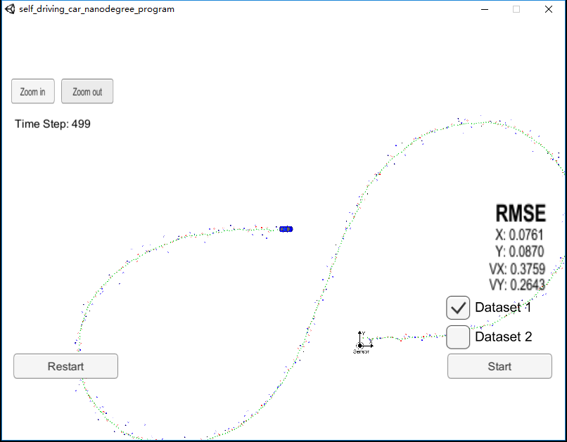
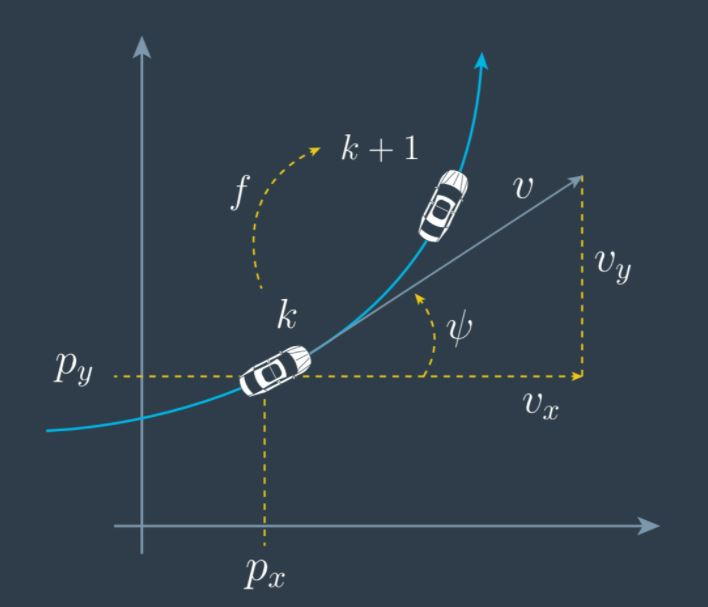
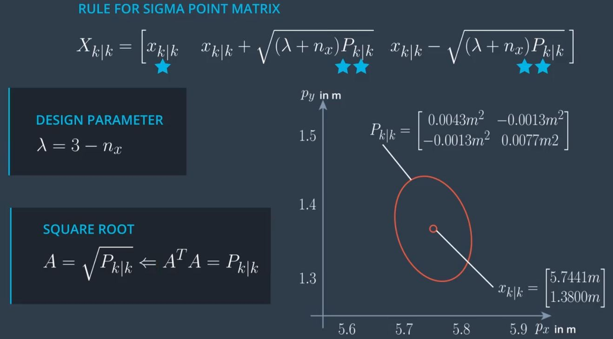
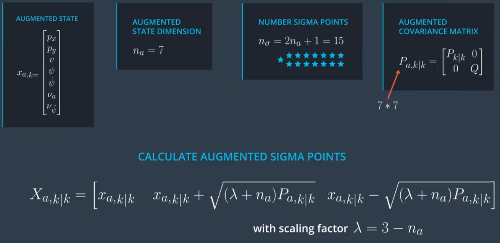
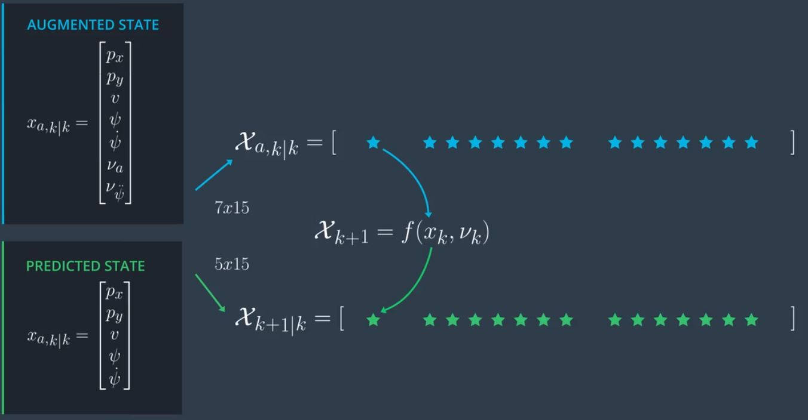
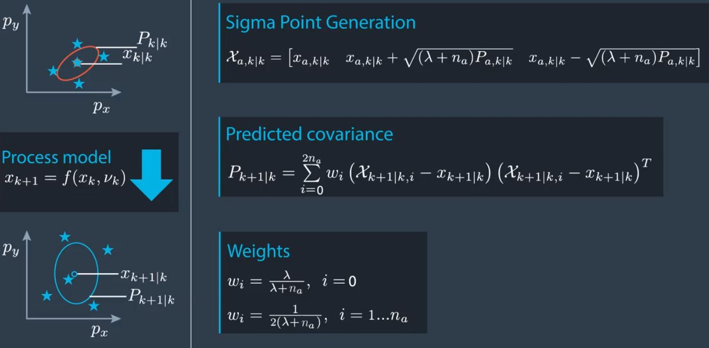
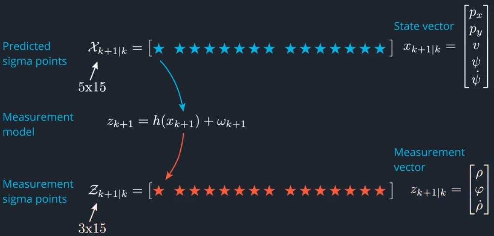
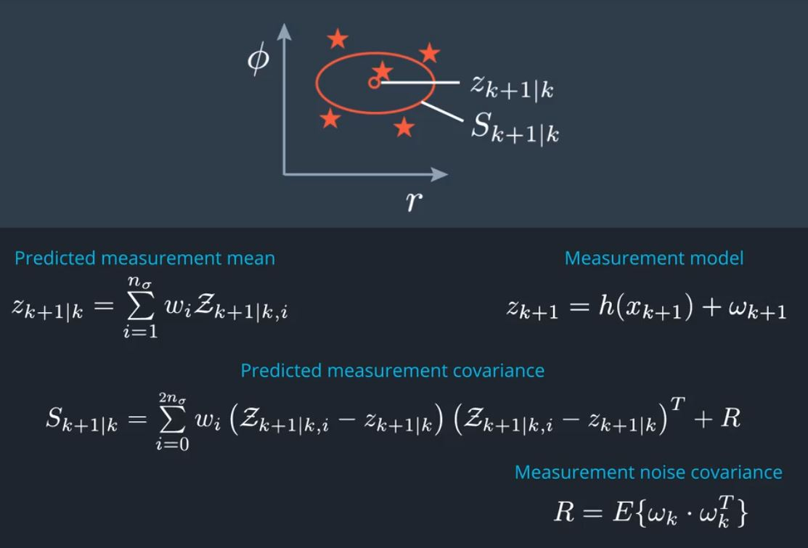
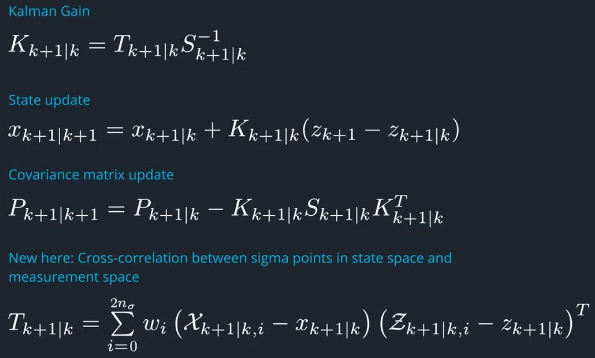

# Unscented Kalman Filter Project
Self-Driving Car Engineer Nanodegree Program

## Overview

In this project utilize an Unscented Kalman Filter to estimate the state of a moving object of interest with noisy lidar and radar measurements. Passing the project requires obtaining RMSE values [px,py,vx,vy] that are less than or equal to the values [0.09,0.10,0.40,0.30]. 

This project involves the Term 2 Simulator which can be downloaded [here](https://github.com/udacity/self-driving-car-sim/releases)

## Write Up

### Motion Model

In this project,we will work with the CTRV (Constant Turn Rate and Velocity magnitude model) model.

** CTRV Model State Vector ：** $ x_k =  \begin{bmatrix} p_x \\ p_y \\ v \\ \psi \\ \dot{\psi} \end{bmatrix} $

** CTRV Model Equation ：**

$ \dot{p_x} = v_x = cos(\psi) \cdot v $

$ \dot{p_y} = v_y = sin(\psi) \cdot v $

$ x_{k+1} = x_k + \int_{t_k}^{t_{k+1}}{\begin{bmatrix} \dot{p_x}(t) \\ \dot{p_y}(t) \\ \dot{v}(t) \\ \dot{\psi}(t) \\ \ddot{\psi}(t) \end{bmatrix} dt}  = x_k + \begin{bmatrix} \int_{t_k}^{t_{k+1}}{ cos(\psi(t)) \cdot v(t) dt} \\ \int_{t_k}^{t_{k+1}}{ sin(\psi(t)) \cdot v(t) dt} \\ 0 \\ \dot{\psi}_k \Delta t \\ 0  \end{bmatrix}  = x_k + \begin{bmatrix} v_k \int_{t_k}^{t_{k+1}}{cos(\psi_k +\dot{\psi_k} (t - t_k)) dt} \\ v_k \int_{t_k}^{t_{k+1}}{sin(\psi_k + \dot{\psi_k}(t-t_k)) dt} \\ 0 \\ \dot{\psi_k} \Delta t \\ 0 \end{bmatrix} $

*Note:* We assume that velocity (v) and turn rate ($\dot{\psi}$) are constant.

If $\dot{\psi_k} \neq 0 $,then 

$ x_{k+1} = x_k + \begin{bmatrix} \frac{v_k}{\dot{\psi_k}} (sin(\psi_k + \dot{\psi_k} \Delta t) - sin(\psi_k)) \\ \frac{v_k}{\dot{\psi_k}} (-cos(\psi_k + \dot{\psi_k} \Delta t) + cos(\psi_k)) \\ 0 \\ \dot{\psi_k} \Delta t \\ 0 \end{bmatrix} $

If $\dot{\psi_k} = 0 $, then 

$ x_{k+1} = x_k + \begin{bmatrix} v_k cos(\psi_k) \Delta t \\ v_k sin(\psi_k) \Delta t \\ 0 \\ 0 \\ 0 \end{bmatrix} $

**Process Noise Vector :** $ \nu_k = \begin{bmatrix} \nu_{a,k} \\ \nu_{\ddot{\psi},k} \end{bmatrix} $

**Process Model:**

$ x_{k+1} = x_k + \begin{bmatrix} \frac{v_k}{\dot{\psi_k}} (sin(\psi_k + \dot{\psi_k} \Delta t) - sin(\psi_k)) \\ \frac{v_k}{\dot{\psi_k}} (-cos(\psi_k + \dot{\psi_k} \Delta t) + cos(\psi_k)) \\ 0 \\ \dot{\psi_k} \Delta t \\ 0 \end{bmatrix}  + \begin{bmatrix} \frac{1}{2}(\Delta t)^2 cos(\psi_k) \cdot \nu_{a,k} \\ \frac{1}{2} (\Delta t)^2 sin(\psi_k) \cdot \nu_{a,k} \\ \Delta t \cdot \nu_{a,k} \\ \frac{1}{2} (\Delta t)^2 \cdot \nu_{\ddot{\psi},k} \\ \Delta t \cdot \nu_{\ddot{\psi},k}  \end{bmatrix} $

### UKF Roadmap

**Prediction Step:**

* Generate Sigma Points
* Predict Sigma Points
* Predict Mean and Covariance

**Update Step:**

* Predict Measurement 
* Update State

#### Generate Sigma Points

* Posterior State : $x_{k|k}$
* Posterior Covariance Matrix :$P_{k|k}$
* State Vector : $x = \begin{bmatrix} p_x \\ p_y \end{bmatrix} $
* State Dimension : $n_x = 2$
* Number Sigma Points : $ n_{\sigma} = 2n_x + 1 = 7 $

** UKF Augmention **:

* Posterior Distribution : $x_{k|k} , P_{k|k} $
* Process Noise : $ \nu_k = \begin{bmatrix} \nu_{a,k} \\ \nu_{\ddot{\psi},k} \end{bmatrix} $
* Process Model : $ x_{k+1} = f(x_k,\nu_k)$
* Process Nosie Covariance Matrix : $ Q = E \begin{Bmatrix} \nu_k \cdot \nu_k^T \end{Bmatrix}  = \begin{bmatrix} \sigma_a^2 & 0 \\ 0 & \sigma_{\ddot{\psi}}^2 \end{bmatrix} $

#### Predict Sigma Points

#### Predict Mean and Covariance

**Weights**:

$ \omega_i = \frac {\lambda}{\lambda + n_a} , i = 1 $

$ \omega_i = \frac {1}{2(\lambda + n_a)} , i = 2...n_a$

** Predicted Mean **:

$ x_{k+1 | k} = \sum_{i=1}^{n_{\sigma}} { \omega_i X_{k+1 |k,i}} $

** Predicted Covariance**:

$ P_{k+1|k} = \sum_{i=1}^{n_{\sigma}} {\omega_i (X_{k+1|k,i} - x_{k+1|k} )(X_{k+1|k,i} - x_{k+1|k})^T} $

#### Measurement Prediction

** Measurement Nosie **: $\omega_{k+1} $

** Measurement Model **: $ z_{k+1|k} = h(x_{k+1}) + \omega_{k+1} $

$ \rho =  \sqrt{p_x^2 + p_y^2} $

$ \varphi = arctan(\frac{p_y}{p_x})  $

$ \dot{\rho} = \frac{p_x cos(\psi)v + p_y sin(\psi)v}{\sqrt{p_x^2 + p_y^2}} $

** Predict Measurement Mean And Covariance **:

#### UKF Update

## Run Project

Once the install for uWebSocketIO is complete, the main program can be built and ran by doing the following from the project top directory.

1. mkdir build
2. cd build
3. cmake ..
4. make
5. ./UnscentedKF

Here is the main protcol that main.cpp uses for uWebSocketIO in communicating with the simulator.

**INPUT:** values provided by the simulator to the c++ program

["sensor_measurement"] => the measurment that the simulator observed (either lidar or radar)

**OUTPUT:** values provided by the c++ program to the simulator

["estimate_x"] <= kalman filter estimated position x

["estimate_y"] <= kalman filter estimated position y

["rmse_x"]

["rmse_y"]

["rmse_vx"]

["rmse_vy"]

---

## Other Important Dependencies
* cmake >= 3.5
  * All OSes: [click here for installation instructions](https://cmake.org/install/)
* make >= 4.1 (Linux, Mac), 3.81 (Windows)
  * Linux: make is installed by default on most Linux distros
  * Mac: [install Xcode command line tools to get make](https://developer.apple.com/xcode/features/)
  * Windows: [Click here for installation instructions](http://gnuwin32.sourceforge.net/packages/make.htm)
* gcc/g++ >= 5.4
  * Linux: gcc / g++ is installed by default on most Linux distros
  * Mac: same deal as make - [install Xcode command line tools](https://developer.apple.com/xcode/features/)
  * Windows: recommend using [MinGW](http://www.mingw.org/)

## Basic Build Instructions

1. Clone this repo.
2. Make a build directory: `mkdir build && cd build`
3. Compile: `cmake .. && make`
4. Run it: `./UnscentedKF` Previous versions use i/o from text files.  The current state uses i/o
from the simulator.
